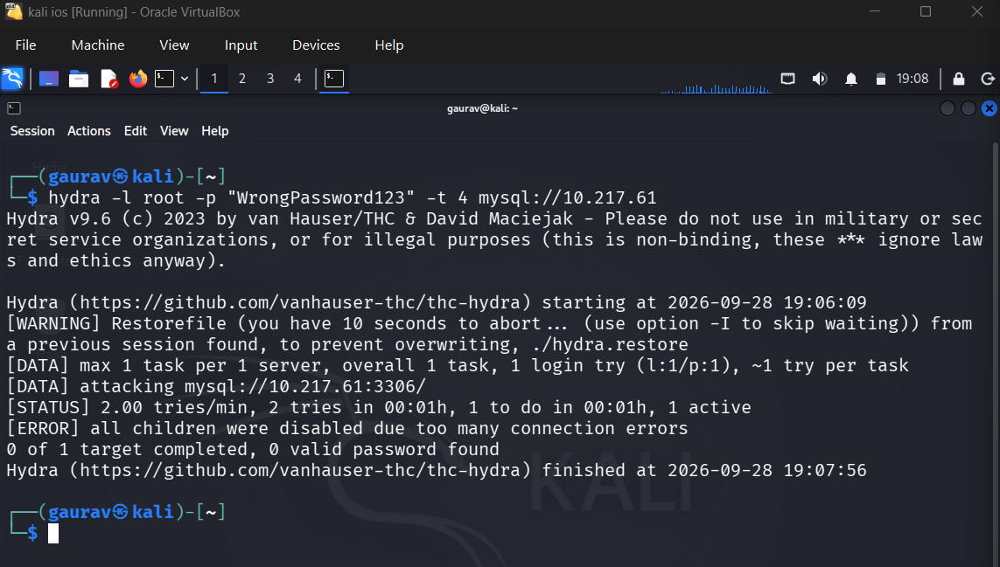
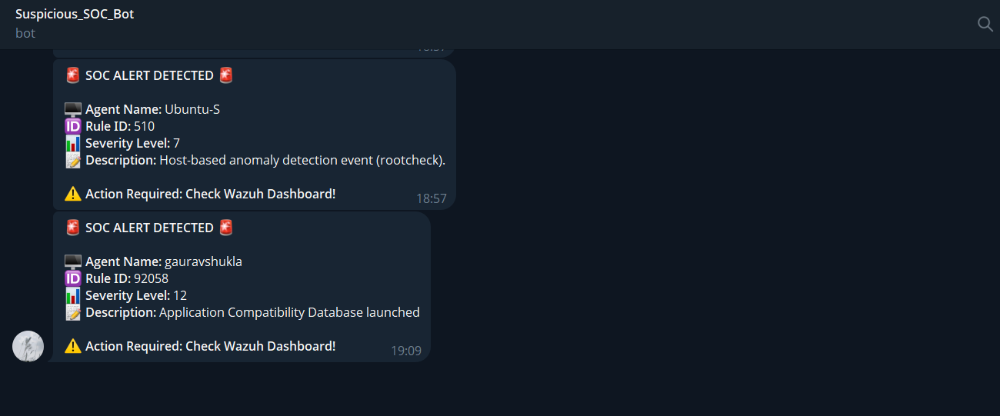

# Wazuh-SIEM-Automated-Threat-Response
An end-to-end SIEM/SOAR home lab built to detect Windows endpoint threats and automate real-time alerting via Telegram Bot API.
# Automated SOC Monitoring & Real-Time Incident Response System
An end-to-end Security Operations Center (SOC) home lab built to detect dynamic endpoint threats and automate real-time incident responses using SIEM and SOAR models.

## 🗺️ Lab Architecture
- **Offensive Machine:** Kali Linux VM (Threat Simulation & Enumeration)
- **Defensive Endpoint:** Windows 11 Host running Wazuh Agent & Microsoft Sysmon
- **Central SIEM Cluster:** Ubuntu Server running Wazuh Manager & Dashboard
- **SOAR Notification Pipeline:** Custom Python Script integrated with Telegram Bot API

## 🛠️ Key Capabilities Implemented
1. **Endpoint Log Ingestion:** Successfully configured Windows 11 host to securely stream Event Channels and Sysmon logs to a centralized Wazuh SIEM Manager.
2. **Threat Simulation:** Executed Nmap dynamic port reconnaissance and targeted brute-force enumeration simulations against open database ports (Port 3306 MySQL).
3. **Log Parsing & Fine-Tuning:** Modified `ossec.conf` file to change alerting thresholds to Level 3+, capturing baseline asset manipulations alongside critical system alerts.
4. **SOAR Incident Automation:** Developed an asynchronous Python notification engine utilizing binary strings to bypass runtime terminal truncations and immediately push high-severity alerts (like Sysmon Rule ID 61640 Level 12 and Login Failure Rule ID 60110 Level 8) straight to an analyst's Telegram end-point in under 5 seconds.

## 📊 Project Evidence & Artifacts
Here are the live results captured during the dynamic testing phase:

### 1. Offensive Reconnaissance (Kali Linux Nmap Scan)
This screen captures the offensive machine successfully scanning the open database layers on the production host.

### 2. Real-Time Automated SOC Alert (Telegram Notification)
This screen captures the automated SOAR response framework delivering instantaneous critical alarms (Severity Level 12 & Level 8) straight to an analyst endpoint.

